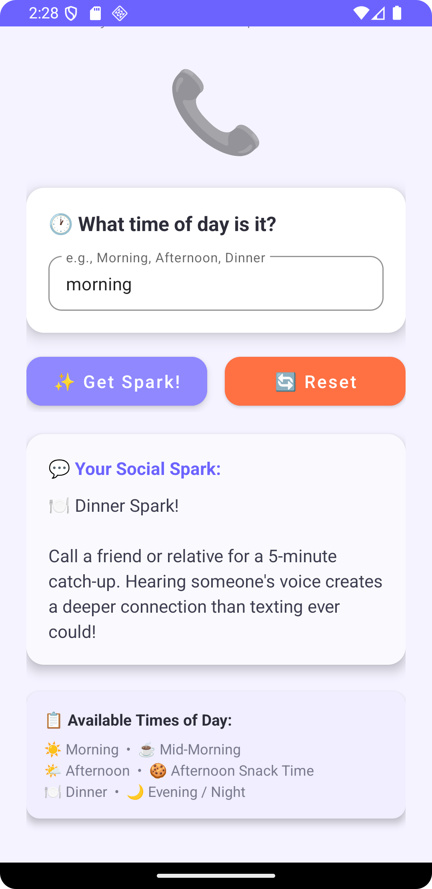
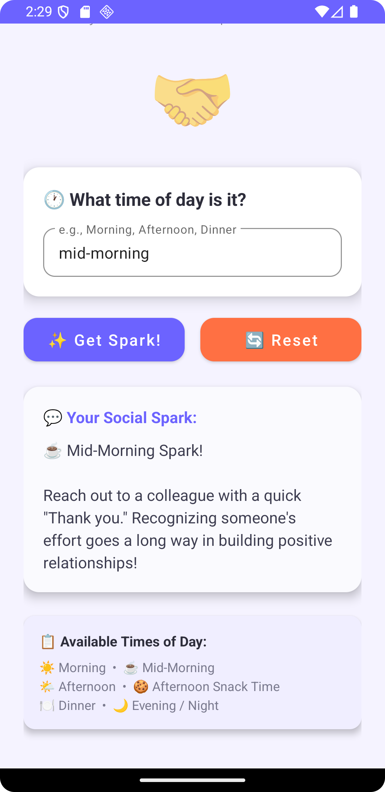
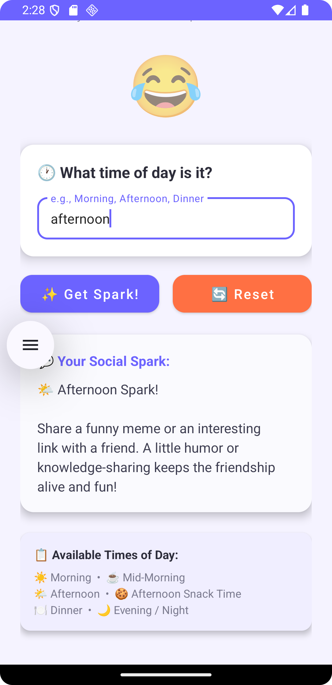
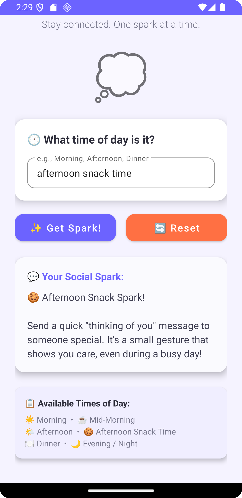
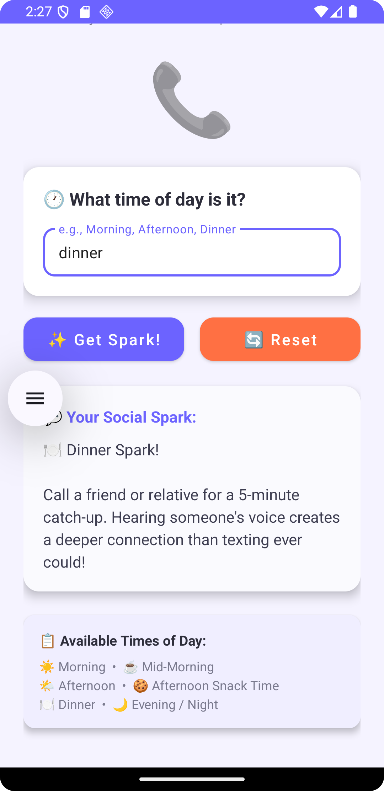
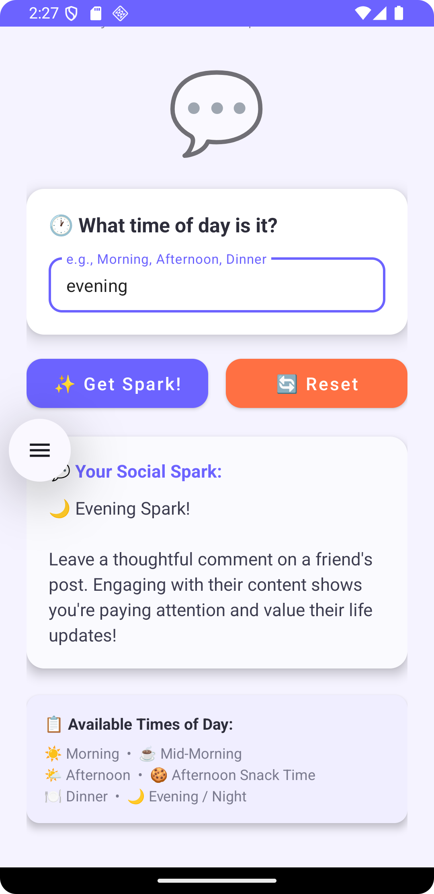
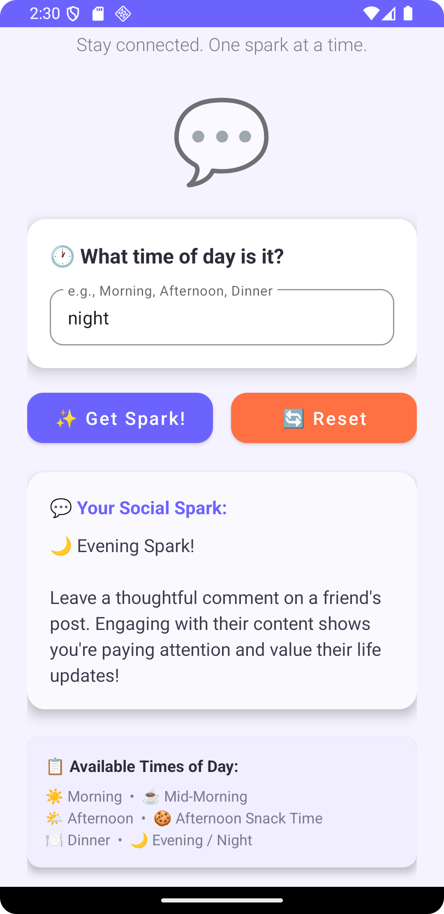
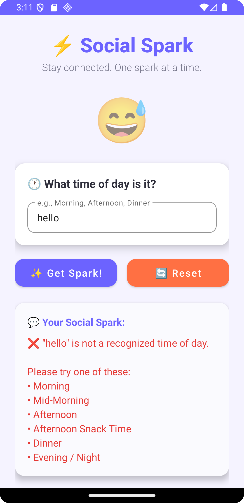

# ⚡ Social Spark - Social Interaction Suggestion App

## 📱 Overview

**Social Spark** is a native Android application built with **Kotlin** in **Android Studio** designed to help users maintain social connections during busy days. The app suggests small social "sparks" — simple actions based on the time of day — to keep users connected with friends, family, and colleagues.

This app was developed as part of the **IMAD5112** (Introduction to Mobile Application Development) module assignment.

---

## 👤 Author

**Oratile Moeng**

---

## 🎯 Purpose

The app was created for **Cora**, who has been struggling to maintain social connections during busy days. Social Spark simplifies social interactions by providing time-based suggestions that are quick, easy, and meaningful.

---

## 🎬 Video Demonstration

📺 [Watch the app demonstration video here](https://youtube.com/shorts/hxSgUHA0nuQ?si=xzNKriEpR2AD7GAc)

---

## ✨ Features

### 1. Time-Based Social Suggestions
Users enter a time of day and receive a personalized social interaction suggestion:

| Time of Day | Social Spark Suggestion |
|---|---|
| ☀️ Morning | Send a "Good morning" text to a family member |
| ☕ Mid-Morning | Reach out to a colleague with a quick "Thank you" |
| 🌤️ Afternoon | Share a funny meme or interesting link with a friend |
| 🍪 Afternoon Snack Time | Send a "thinking of you" message to someone special |
| 🍽️ Dinner | Call a friend or relative for a 5-minute catch-up |
| 🌙 Evening / Night | Leave a thoughtful comment on a friend's post |

### 2. User-Friendly Interface
- Clean, modern Material Design UI with cards and rounded buttons
- Emoji-enhanced experience for a fun and engaging feel
- Helpful reference section showing all valid time inputs
- Responsive scroll layout

---

## 📸 App Screenshots

| Morning | Mid-Morning | Afternoon |
|---|---|---|
|  |  |  |

| Afternoon Snack Time | Dinner | Evening |
|---|---|---|
|  |  |  |

| Night |
|---|
|  |

---

### 3. Error Handling
- **Empty input detection**: Friendly prompt to enter a time of day
- **Invalid input handling**: Clear message listing all valid options
- **Color-coded feedback**: Red for errors, default for valid suggestions

| Empty Input Error | Invalid Input Error |
|---|---|
|  |  |

### 4. Reset Functionality
- One-tap reset button clears all input and output fields
- Returns the app to its initial welcoming state

---

## 🛠️ Design Considerations

### Architecture
- **Single Activity architecture** using `MainActivity.kt`
- **Separation of concerns**: Input handling, suggestion logic, and UI updates are in separate methods
- **When expression** (Kotlin's enhanced switch/if statement) for clean time-of-day matching

### UI/UX Design
- **Material Design components** (MaterialButton, TextInputLayout, CardView)
- **Purple-themed colour scheme** (#6C63FF) for a modern, vibrant look
- **Card-based layout** for clean content separation
- **ScrollView** wrapper to support all screen sizes
- **Emoji indicators** provide visual context for each suggestion

### Error Handling Strategy
- Input validation checks for empty strings before processing
- Case-insensitive matching (converts input to lowercase)
- Whitespace trimming to handle accidental spaces
- Multiple accepted variations (e.g., "mid-morning", "mid morning", "midmorning")
- Constructive error messages that guide the user to correct input

### Logging
- Comprehensive `Log` statements throughout the app using Android's `Log` utility
- Log levels used: `Log.d` (debug), `Log.i` (info), `Log.w` (warning)
- Tagged with "SocialSparkApp" for easy filtering in Logcat

---

## 🔧 Technical Stack

| Component | Technology |
|---|---|
| Language | Kotlin |
| IDE | Android Studio |
| Min SDK | 24 (Android 7.0) |
| Target SDK | 34 (Android 14) |
| UI Framework | Material Components for Android |
| Build System | Gradle (Kotlin DSL) |
| CI/CD | GitHub Actions |
| Version Control | Git & GitHub |

---

## 📂 Project Structure

```
SocialSpark/
├── .github/
│   └── workflows/
│       └── build.yml              # GitHub Actions CI workflow
├── app/
│   ├── src/
│   │   ├── main/
│   │   │   ├── java/com/oratile/socialspark/
│   │   │   │   └── MainActivity.kt    # Main app logic
│   │   │   ├── res/
│   │   │   │   ├── layout/
│   │   │   │   │   └── activity_main.xml  # UI layout
│   │   │   │   └── values/
│   │   │   │       ├── colors.xml     # Colour definitions
│   │   │   │       ├── strings.xml    # String resources
│   │   │   │       └── themes.xml     # App theme
│   │   │   └── AndroidManifest.xml
│   │   └── test/
│   │       └── java/com/oratile/socialspark/
│   │           └── SuggestionLogicTest.kt  # Unit tests
│   ├── build.gradle.kts
│   └── proguard-rules.pro
├── build.gradle.kts               # Project-level build config
├── settings.gradle.kts
├── gradle.properties
└── README.md                      # This file
```

---

## 🚀 GitHub & GitHub Actions

### Version Control
This project uses **Git** for version control and is hosted on **GitHub**. All code changes are tracked through detailed commits with proper naming conventions.

### Automated Building with GitHub Actions
A CI/CD pipeline is configured using **GitHub Actions** to automatically:
1. **Run unit tests** on every push to the `main` branch
2. **Build the app** to verify it compiles without errors
3. **Upload the APK** as a build artifact

The workflow file is located at `.github/workflows/build.yml`.

References for GitHub Actions setup:
1. [Automated Build Android App with GitHub Action](https://github.com/marketplace/actions/automated-build-android-app-with-github-action)
2. [GitHub Actions Build Workflow](https://github.com/IMAD5112/Github-actions/blob/main/.github/workflows/build.yml)

---

## 🧪 Testing

### Unit Tests
Unit tests are located in `app/src/test/java/com/oratile/socialspark/SuggestionLogicTest.kt` and cover:
- ✅ All six time-of-day suggestions return correct results
- ✅ Case insensitivity (MORNING, morning, Morning all work)
- ✅ Multiple input variations (mid-morning, mid morning, midmorning)
- ✅ Invalid input returns null (triggers error handling)
- ✅ Whitespace handling (extra spaces are trimmed)
- ✅ Empty input handling

### Manual Testing
The app has been manually tested on the Android emulator to verify:
- App launches without crashes
- All time inputs produce correct suggestions
- Error messages display for invalid input
- Reset button clears all fields
- UI scrolls properly on different screen sizes

---

## 📋 How to Run

1. Clone the repository:
   ```bash
   git clone https://github.com/moengapp/IMAD5112-SocialSpark.moengapp.git
   ```
2. Open the project in **Android Studio**
3. Sync Gradle files
4. Run the app on an emulator or physical device (API 24+)

---

## 📚 References

- Android Developers. (2024). *Android Studio Documentation*. Available at: https://developer.android.com/studio (Accessed: 30 March 2026).
- Android Developers. (2024). *Kotlin on Android*. Available at: https://developer.android.com/kotlin (Accessed: 30 March 2026).
- Google. (2024). *Material Design Components for Android*. Available at: https://material.io/develop/android (Accessed: 30 March 2026).
- GitHub. (2024). *GitHub Actions Documentation*. Available at: https://docs.github.com/en/actions (Accessed: 30 March 2026).
- JetBrains. (2024). *Kotlin Language Documentation*. Available at: https://kotlinlang.org/docs/home.html (Accessed: 30 March 2026).

---

*Developed by Oratile Moeng for IMAD5112 - Introduction to Mobile Application Development*
